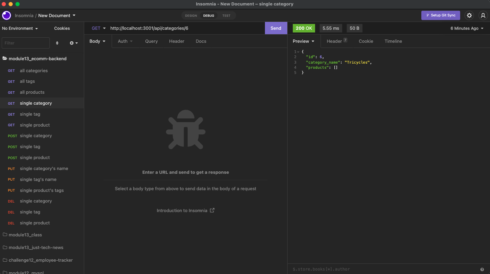

# Ecomm Backend
<a href="#license"></img></a>

## Description
The backend for an e-commerce site. Started with working Express.js APIs and configured it to use Sequelize to interact with a MySQL database.

### User Story
AS A manager at an internet retail company
I WANT a back end for my e-commerce website that uses the latest technologies
SO THAT my company can compete with other e-commerce companies

## Table of Contents
- <a href="#acceptance-criteria">Acceptance Criteria</a>
- <a href="#installation">Installation</a>
- <a href="#usage">Usage</a>
- <a href="#mock-up">Mock-Up</a>
- <a href="#deployed-application">Deployed Application</a>
- <a href="contributors">Contributors</a>
- <a href="#license">License</a>

## Acceptance Criteria
GIVEN a functional Express.js API

WHEN I add my database name, MySQL username, and MySQL password to an environment variable file
THEN I am able to connect to a database using Sequelize

WHEN I enter schema and seed commands
THEN a development database is created and is seeded with test data

WHEN I enter the command to invoke the application
THEN my server is started and the Sequelize models are synced to the MySQL database

WHEN I open API GET routes in Insomnia for categories, products, or tags
THEN the data for each of these routes is displayed in a formatted JSON

WHEN I test API POST, PUT, and DELETE routes in Insomnia
THEN I am able to successfully create, update, and delete data in my database

## Installation
- Clone the directly from the GitHub repository to your local machine.
- Run _npm init_ in the command line.
- Run _node seeds/index.js_ in the command line to seed the database.
- Run the command _node server.js_ to launch the application.

## Usage
To have an online e-comm inventory that can be Created, Read, Updated, and Deleted.

## Mock-Up
**GET routes** for all categories, all products, and all tags:

**GET routes** for a single category, single product, and single tag:

**POST, PUT, AND DELTE routes** for categories:

## Deployed Application
Live url: n/a
Repo url: https://github.com/cpm-128/ecomm-backend

### Screencapture
**GET ALL route** one example from deployed application

**GET SINGLE BY ID route** one example from deployed application

**POST SINGLE BY ID route** one example from deployed application

**PUT SINGLE BY ID route** one example from deployed application

**DELETE SINGLE BY ID route** one example from deployed application

### Video Walkthrough
<a href="https://drive.google.com/file/d/1R1jbylcUV1iugMlRzCRJhJWrRMHdGSEi/view?usp=sharing">Watch here.</a>

## Contributors
UNC Bootcamp <a href="https://github.com/coding-boot-camp/fantastic-umbrella">starter code</a>.

## License
MIT License

Copyright (c) [2022] [Colleen Maher]

Permission is hereby granted, free of charge, to any person obtaining a copy
of this software and associated documentation files (the "Software"), to deal
in the Software without restriction, including without limitation the rights
to use, copy, modify, merge, publish, distribute, sublicense, and/or sell
copies of the Software, and to permit persons to whom the Software is
furnished to do so, subject to the following conditions:

The above copyright notice and this permission notice shall be included in all
copies or substantial portions of the Software.

THE SOFTWARE IS PROVIDED "AS IS", WITHOUT WARRANTY OF ANY KIND, EXPRESS OR
IMPLIED, INCLUDING BUT NOT LIMITED TO THE WARRANTIES OF MERCHANTABILITY,
FITNESS FOR A PARTICULAR PURPOSE AND NONINFRINGEMENT. IN NO EVENT SHALL THE
AUTHORS OR COPYRIGHT HOLDERS BE LIABLE FOR ANY CLAIM, DAMAGES OR OTHER
LIABILITY, WHETHER IN AN ACTION OF CONTRACT, TORT OR OTHERWISE, ARISING FROM,
OUT OF OR IN CONNECTION WITH THE SOFTWARE OR THE USE OR OTHER DEALINGS IN THE
SOFTWARE.